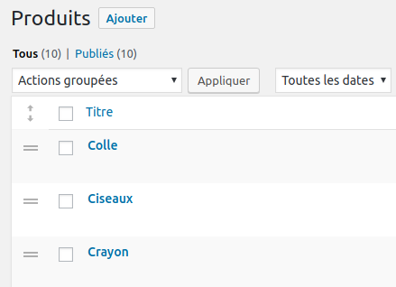

# post-order

A WordPress plugin to allows changing posts order by drag and drop in admin listings.
The feature is enabled per *post type* using a filter. When enabled, corresponding
post type is ordered by `menu_order` in all main queries (on front and on admin screens).

**Disclaimer:** I’m publishing this here because it might be useful to others,
but USE OF THIS SCRIPT IS ENTIRELY AT YOUR OWN RISK. I accept no liability from its use.  
That said, I’m using this plugin for several clients and I’m interested in any feature
or security improvement. So please contact me for this kind of requests.

This plugin also work for taxonomy terms.

## Installation

You can drop the plugin folder in your `wp-content/plugins` or `wp-content/mu-plugins` directory.  
I recommend using `wp-content/mu-plugins` because that plugin is related to the content, so
it shouldn’t be managed by site admin like features (`plugins`) or appearance (`themes`).

If you use the `mu-plugins` directory, don’t forget to require it from an upper-level file
like `/wp-content/mu-plugins/index.php`:

```php
require_once __DIR__ .'/post-order/post-order.php';
```

## Usage

You need to add a *filter* to enable the feature for a post type. For example to enable the
ordering feature on a `product` post type, you’ll add (in another `mu-plugin`):

```php
add_filter('is_post_type_ordered', function ($is_ordered, $post_type) {
    return $post_type === 'product' ? true : $is_ordered;
}, 10, 2);
```

To enable the feature for several CPT at a time (here `team` and `product`):

```php
add_filter('is_post_type_ordered', function ($is_ordered, $post_type) {
    return array_search($post_type, ['team', 'product']) !== false ? true : $is_ordered;
}, 10, 2);
```

For a taxonomy, the filter is `is_taxonomy_ordered` and receive corresponding arguments:

```php
add_filter('is_taxonomy_ordered', function ($is_ordered, $taxonomy) {
    return $taxonomy === 'category' ? true : $is_ordered;
}, 10, 2);
```

When enabled on a post type or taxonomy, two things happen:

1. Main queries for that post type are ordered by `menu_order` (or `term_order` for taxonomies)
2. In admin screen a sort handle appears next to the posts or taxonomy items on the listings:



## Support

I’m interested in any feedback.

## Author

Jérôme Mulsant [https://rue-de-la-vieille.fr](https://rue-de-la-vieille.fr)